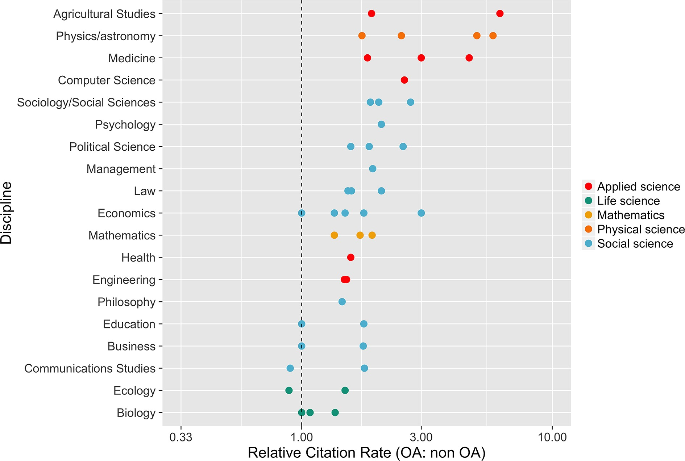

```{r setup, include=FALSE}
knitr::opts_chunk$set(echo = FALSE)
```

# Introduction 

----

## Make a Twitter account and type 

```
#openscience
``` 
----

## Define #openscience

From [Wikipedia](https://en.wikipedia.org/wiki/Open_science)

```
Open science is the movement to make scientific research, 
data and dissemination accessible to all levels of 
an inquiring society, amateur or professional.
```
----

## Define #openscience

From [FOSTER](https://www.fosteropenscience.eu/foster-taxonomy/open-science-definition)

```
Open Science is the practice of science 
in such a way that others can 
collaborate and contribute,
where research data, lab notes and 
other research processes are freely available, 
under terms that enable reuse, redistribution and 
reproduction of the research and 
its underlying data and methods. 
```

----

## Define #openscience

According to [Openscience.org](http://www.openscience.org/blog/?p=269)

```
... four fundamental goals:

- Transparency in experimental methodology, 
observation, and collection of data.
- Public availability and reusability of 
scientific data.
- Public accessibility and transparency of 
scientific communication.
- Using web-based tools to facilitate 
scientific collaboration.
```
----

# What's going on right now in Indonesia

----

## High demands on:

- international publications
- citations
- research transparency and accountability 

----

## Misuse of scientific databases:

  - journals indexed by Scopus, WoS   = reputable journals
  - articles indexed by Scopus, WoS   = reputable articles
  - authors whose name on Scopus, WoS = reputable authors/researchers

Hence they deserve grants/incentives.

----

# Benefits of #openscience

The benefits according to [Whyopenresearch](http://whyopenresearch.org)

<div align="center">

</div>

----

## How #openscience helps scholars

According to [McKiernan et al., 2016](https://elifesciences.org/content/5/e16800)

Follow her [@mckiernan13](https://twitter.com/emckiernan13)

----

## How #openscience helps scholars to ...
- gain more visibility of their works: in open access journals, blogs, preprint servers, and repositories; 
- get a persistent address for their works: attaching doi (digital object identifier);
- get more citations: by applying metrics like [Altmetrics](altmetrics.org);
- harvest more inputs: via comments and reviewing facilities like [Publons](publons.com); or via scientific publishing platform like [ScienceOpen](scienceopen.com);
- get more attentions from grant funders: do you know that you can publish a grant proposal? Yes you can, eg on [RIOJournal](riojournal.com)

----

## What does it take to get more citations? 

Shifted perpective:

- **open access** articles get more citations
- articles with **open data** get more citations
- articles with **open method** get more citations

----

## Relative citation of articles in OA/non-OA journals (McKiernan et al., 2016)

<div align="center">

</div>

----

## Table of preprint servers and general repositories accepting preprints

Pls go to this [link](http://dx.doi.org/10.7554/eLife.16800.003).

We will see [ArXiv](arxiv.org), [BiorXiv](biorxiv.org), [SocarXiv](https://osf.io/view/socarxiv/), [Figshare](figshare.com), [Zenodo](zenodo.org), and [OpenScienceFramework](osf.io).

----

## The (obvious) benefits

- **more exposures**: even to those who don't have access to journal subscription
- **reproducibility**: allowing others to reproduce your work and validate it; **replicability**: allowing others to apply your work (methods) to their own work
- **transparent and accountable**: allowing grant funder to monitor your progress

----

## The (obvious) benefits

- then **citation and more citations** will (eventually) follow

----

# Recommended practices (my own)

- hold on to your rights: your research is yours and yours only
- publish early, publish often: science evolves, publishing means opportunity 
- publish openly or self archiving

----

# There're more innovations to come

- Remembering getting your first blind reviews;
- Well now, we have `post publication peer review`. Publish first and getting comments afterwards, example: [ScienceOpen](scienceopen.com), [F1000Research](F1000Research.com), [ESSD](http://www.earth-syst-sci-data-discuss.net/);
- Plus, you get to see your reviewer's name (open review system).

----

# Article's metrics: beyond Impact Factor

- Now we do have [Altmetrics](Altmetrics.com), to measure the online conversations on your article;
- Or you can put on your page on [ImpactStory](ImpactStory.org);
- Since [ResearchGate](researchgate.net) social media is also very popular, why don't you put your works there and get scored.

----

# collaborate, collaborative, collaboration

You can't do all by yourself. That's why now we have collaborative platforms:

- writing platforms, like: [Overleaf](overleaf.com), [Authorea](authorea.com), [Papeeria](Papeeria.com) 
- research platforms: [OSF](osf.io)
- publishing platforms: [ScienceOpen](ScienceOpen.com). You can even write comments to ArXiv papers.

----

# Or you just simply do it the old way

- Write a blog post and hit `Publish` on Wordpress or Blogger. 
- or better yet connect your blog with [TheWinnower](https://thewinnower.com).

----

# Thank you

- Follow [my twitter acc](www.twitter.com/dasaptaerwin) and connect
- Visit my blogs: 
    - dasaptaerwin.wordpress.com and 
    - dasaptaerwin.net/wp